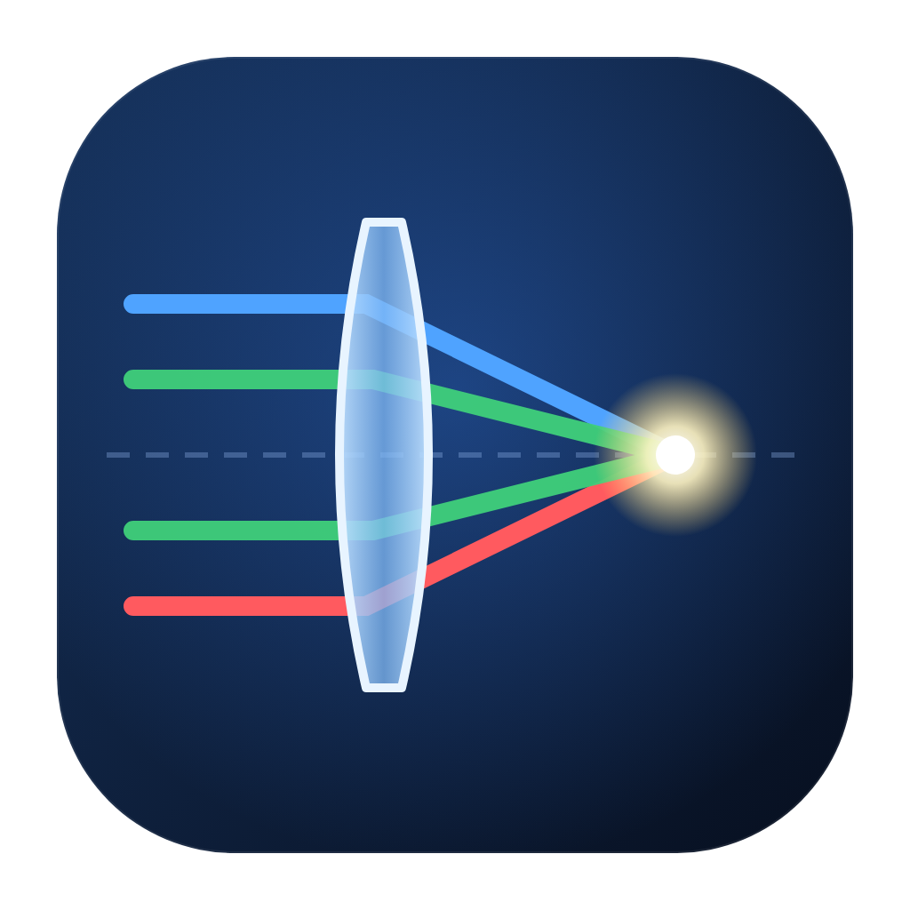
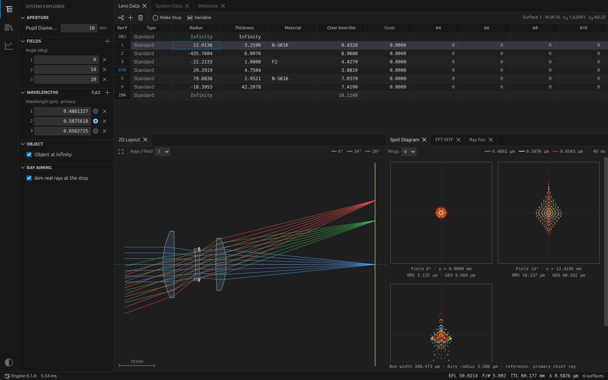

# instaOptics

Free and open-source optical simulation software.

Try it in the browser: **[instaoptics.oneptica.com](https://instaoptics.oneptica.com)**

[](https://github.com/Oneptica/instaOptics/actions/workflows/ci.yml)
[](https://github.com/Oneptica/instaOptics/releases/latest)
[](LICENSE)


[中文](README.zh-CN.md)



## Features

- Sequential ray tracing: spherical, conic and even-asphere surfaces, mirrors, coordinate breaks, real ray aiming
- Aperture: entrance pupil diameter, F/#, object NA, float by stop; fields: angle, object height, image height
- Glasses: Schott catalog, fused silica, CaF₂, `nd/vd` model glasses; OpticStudio `.agf` catalogs (all 13 dispersion formulas) with a search window and Abbe diagram
- Spot diagram, ray fan, FFT MTF, through-focus MTF, MTF vs field, FFT PSF, wavefront map, field curvature and distortion, chromatic focal shift, Seidel aberrations, relative illumination, footprint
- Export plots as PNG and data as CSV
- Beam propagation (physical optics): Gaussian, super-Gaussian and flat-top beams through the system, on axis or along a field's chief ray, with side view, cross sections, beam radius and single-mode fibre coupling
- Coatings and polarization: thin-film coatings per surface (MgF₂, quarter-wave layers, high reflectors, metals), reflectance/transmittance curves, and polarization ray tracing with transmission, diattenuation and retardance over the pupil
- Image simulation on a test chart or any image
- Tolerancing: sensitivity and Monte Carlo
- Optimization (damped least squares)
- 2D and 3D layout
- Zemax `.zmx` import and export

The engine is written in Rust and runs on all CPU cores in a separate process; results update when the system changes.

## Build

Requires Node.js 24 and Rust.

```bash
npm install
npm run dev      # run
npm test         # Rust tests
npm run dist     # installer for the current platform
```
