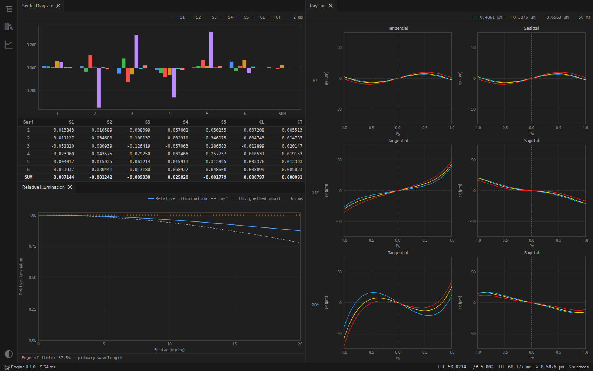
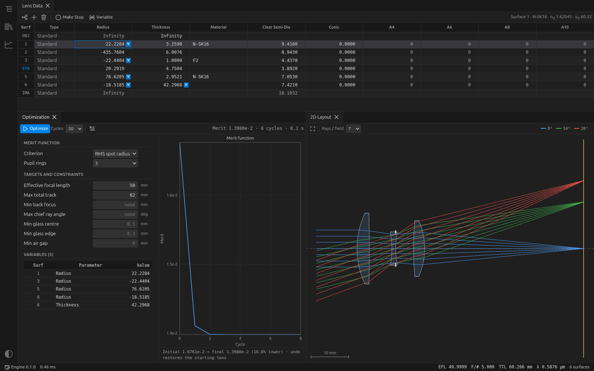
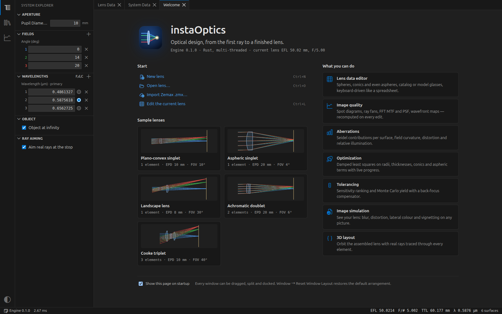

<div align="center">


# instaOptics

**从第一条光线到成品镜头的光学设计软件。**

桌面端镜头设计工作台：多线程 Rust 光线追迹引擎，加上快速、现代的界面。<br>
改一个面，所有分析在毫秒级内刷新。


[English](README.md)

</div>


## 为什么选 instaOptics

- **实时**：每次编辑后，近轴数据、布局图和所有打开的分析窗口都会重新计算。以库克三片式为例，一阶数据和布局图刷新不到 1 毫秒，完整的多色 MTF 也不到 0.2 秒。
- **该快的地方都快**：光学引擎用 Rust 编写，运行在独立进程中。光线追迹、FFT、优化的雅可比矩阵、蒙特卡洛试验都会分摊到所有 CPU 核心上，界面始终不卡。
- **为工程师设计**：表格式的镜头数据编辑器，全程可用键盘操作；分析窗口可停靠、可拆分、可自由排列；有深色和浅色两套主题。
- **开放**：镜头文件是纯 JSON 格式（`.iol`），支持 Zemax `.zmx` 文件的导入和导出。

## 功能一览

<table>
<tr>
<td width="50%"></td>
<td width="50%"></td>
</tr>
<tr>
<td><b>像质分析</b>：多色 FFT MTF，并与衍射极限对比；FFT PSF，给出斯特列尔比和能量集中度；波前图；场曲与畸变。</td>
<td><b>像差分析</b>：逐面的赛德尔像差贡献；所有视场、所有波长的子午和弧矢像差曲线；相对照度与渐晕。</td>
</tr>
<tr>
<td></td>
<td></td>
</tr>
<tr>
<td><b>优化</b>：一键把曲率半径、厚度、二次曲面系数或非球面系数设为变量，以 RMS 点斑或波前误差为目标，运行阻尼最小二乘优化。可约束焦距、总长、后焦、主光线角和边缘厚度。优化过程中镜头实时更新，撤销一次即可回到起点。</td>
<td><b>公差分析</b>：按影响大小给每一项公差排序，包括曲率半径、厚度、偏心、倾斜和玻璃参数；再用数千次蒙特卡洛装配模拟（含后焦补偿）预测良率。</td>
</tr>
<tr>
<td></td>
<td></td>
</tr>
<tr>
<td><b>成像仿真</b>：让测试图或你自己的照片"穿过"镜头成像，看到模糊、畸变、倍率色差、渐晕和 cos⁴ 衰减；还可以调节曝光、伽马、白平衡和饱和度。</td>
<td><b>二维与三维布局</b>：带真实追迹光线的剖面图，以及可以旋转查看的整镜三维模型。</td>
</tr>
</table>

### 全部功能

| 方面 | 内容 |
| --- | --- |
| 镜头模型 | 球面、二次曲面、偶次非球面（A4–A10）；肖特玻璃、熔石英、氟化钙等目录玻璃，以及 `nd/vd` 模型玻璃；无限远或有限远物；真实光线瞄准光阑 |
| 分析 | 点列图、像差曲线、FFT MTF、FFT PSF 与能量集中度、波前图、场曲与畸变、赛德尔像差图、相对照度、系统数据报告 |
| 设计 | 阻尼最小二乘优化，实时显示进度，可随时停止；灵敏度分析与蒙特卡洛公差分析 |
| 可视化 | 可缩放平移的二维布局图、三维布局、带 ISP 的成像仿真 |
| 文件 | `.iol` 镜头文件，Zemax `.zmx` 导入导出，所有编辑均可撤销和重做 |

<p align="center"></p>

## 开始使用

安装包会发布在 Releases 页面。在此之前，可以从源码构建：

```bash
git clone https://github.com/Oneptica/instaOptics.git
cd instaOptics
npm install
npm run dev
```

需要 Node.js 24 和 Rust 工具链（[rustup](https://rustup.rs)），以及对应平台的 C 编译环境：Windows 装 MSVC Build Tools，macOS 装 Xcode 命令行工具，Linux 装 `build-essential`。

启动后的欢迎页里有五个样例镜头，建议从库克三片式开始。

## 路线图

- AGF 玻璃库（肖特、小原、成都光明、豪雅），支持更多色散公式
- F 数、数值孔径、像方孔径；物高和像高视场；视场与波长权重
- 反射镜、坐标断点、奇次非球面、Zernike 面与 XY 多项式面
- 带操作数的评价函数编辑器、多重结构、求解与参数跟随
- 全局优化（锤形优化、多起点搜索）
- 离焦 MTF、MTF 随视场变化、网格畸变、光斑足迹图

## 架构

```
渲染进程（React + TypeScript）    镜头数据编辑器、停靠窗口、绘图、三维（three.js）
   │  MessagePort：直连引擎，图像以二进制传输
计算进程（Electron utility process）  加载 native/optics.node，推送进度，可中途停止
   │  Node-API（napi-rs），任务在 libuv 线程池上运行
optics-core（Rust + rayon）          玻璃、近轴光学、真实光线追迹、各项分析、
                                     优化、公差、成像仿真
```

开发命令、目录结构和文件格式见[英文 README](README.md#development)。
