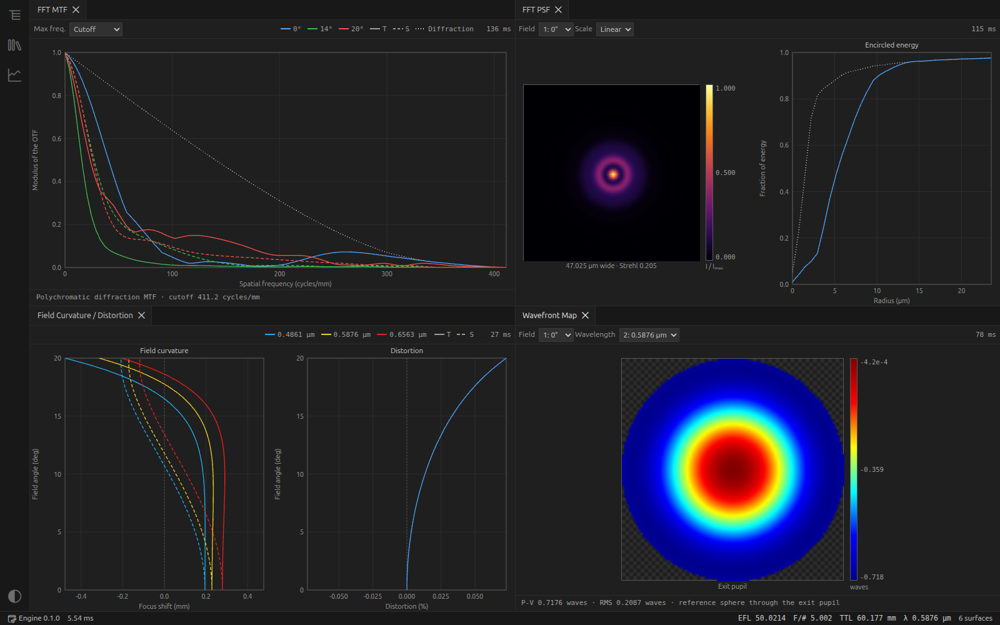
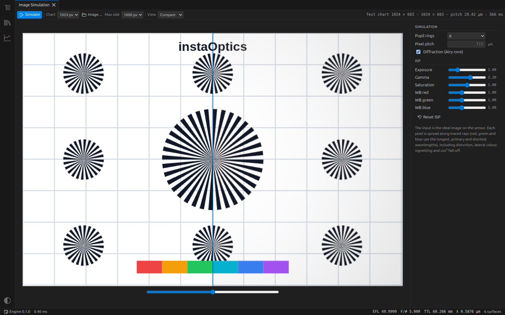
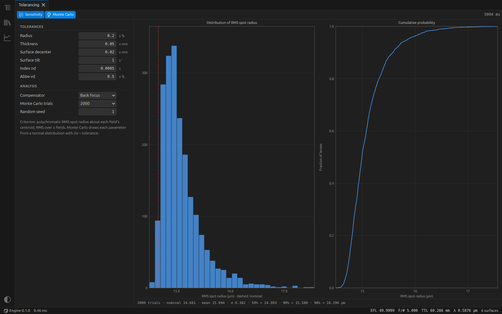
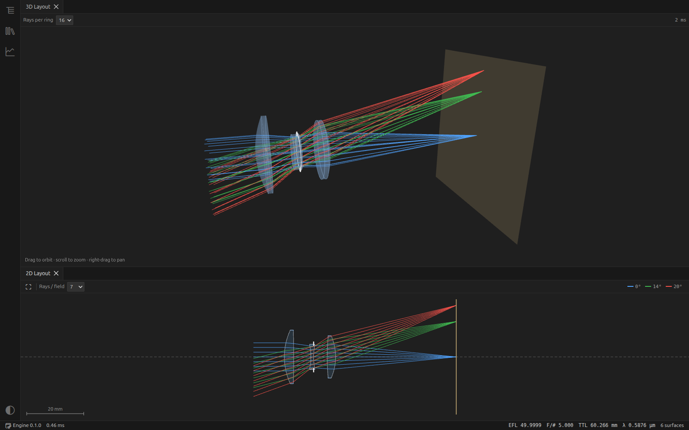

# instaOptics

桌面端光学仿真软件，支持 Windows、macOS、Linux。

在线体验网页版：**[instaoptics.oneptica.com](https://instaoptics.oneptica.com)**

[](https://github.com/Oneptica/instaOptics/actions/workflows/ci.yml)
[](https://github.com/Oneptica/instaOptics/releases/latest)
[](LICENSE)


[English](README.md)



## 功能

- 序列光线追迹：球面、二次曲面、偶次非球面、反射镜、坐标断点，真实光线瞄准
- 孔径：入瞳直径、F 数、物方数值孔径、按光阑浮动；视场：角度、物高、像高
- 玻璃：肖特玻璃库、熔石英、氟化钙，以及 `nd/vd` 模型玻璃
- 点列图、像差曲线、FFT MTF、离焦 MTF、MTF 随视场、FFT PSF、波前图、场曲和畸变、色焦移、赛德尔像差、相对照度、足迹图
- 图像导出为 PNG，数据导出为 CSV
- 光束传播（物理光学）：高斯、超高斯、平顶光束穿过系统，可看侧视图、截面和光束半径
- 成像仿真：可用测试图或任意图片
- 公差分析：灵敏度分析和蒙特卡洛
- 优化：阻尼最小二乘
- 二维和三维布局图
- Zemax `.zmx` 导入导出

计算引擎用 Rust 编写，在独立进程中使用全部 CPU 核心运行；修改系统参数后，结果自动更新。

| | |
| --- | --- |
|  |  |
|  |  |

## 构建

需要 Node.js 24 和 Rust。

```bash
npm install
npm run dev      # 运行
npm test         # Rust 测试
npm run dist     # 打包当前平台的安装包
```

在 Linux 上，如果 `chrome-sandbox` 没有设置 setuid root，`npm run dev` 会自动加上 `--noSandbox` 参数。如果 WebGL 不可用（例如远程桌面或虚拟机），在菜单里打开"视图 → Software 3D Rendering"。

## 目录

| 路径 | 说明 |
| --- | --- |
| `crates/optics-core` | Rust 光学引擎 |
| `crates/optics-node` | Node-API 绑定 |
| `src/main` | Electron 主进程 |
| `src/compute` | 运行引擎的进程 |
| `src/renderer` | 界面（React） |

文件保存为 `.iol` 格式（JSON）。单位：长度 mm，波长 µm，角度为度。
